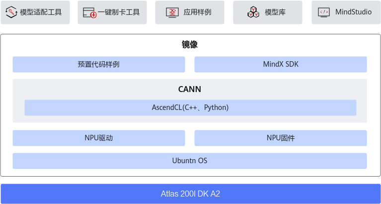
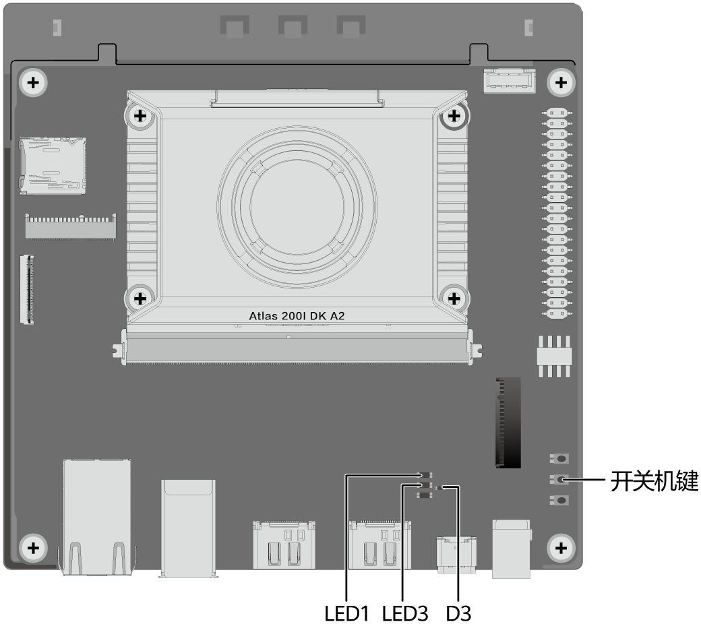
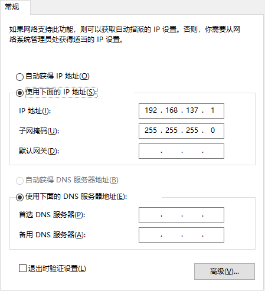
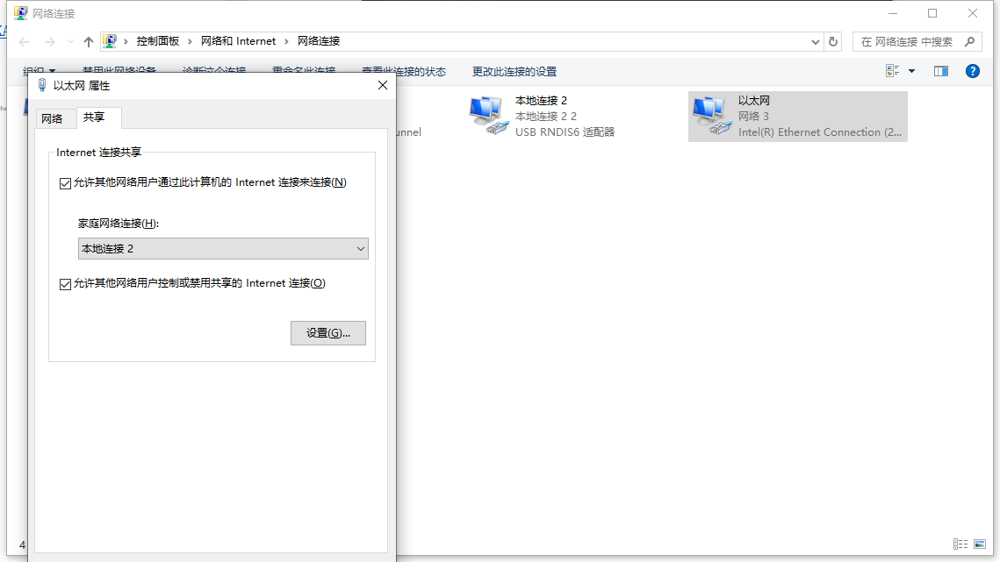

# Ascend算法部署

相关配置参考开发套件的[官方说明书](https://www.hiascend.com/document/detail/zh/Atlas200IDKA2DeveloperKit/23.0.RC2/lg/toctopics/topic_0000001698461113.html)。

## 一、部署Atlas 200I DK A2开发者套件

### （1）[硬件准备](https://www.hiascend.com/document/detail/zh/Atlas200IDKA2DeveloperKit/23.0.RC2/qs/qs_0001.html)与[制卡](https://www.hiascend.com/document/detail/zh/Atlas200IDKA2DeveloperKit/23.0.RC2/qs/qs_0005.html)

硬件示意图如下：

{:height=', width='300px'}

开发环境示意图如下：

{:height='' width='600px'}

### （2）[开机、关机与下电](https://www.hiascend.com/document/detail/zh/Atlas200IDKA2DeveloperKit/23.0.RC2/qs/qs_0023.html)

短按下图中的开关机按键，进行开关机，有以下三种状态：
- 关机：只有D3绿灯亮表示开发者套件已安全关机。
- 开机：开机时，LED1与LED3绿灯依次亮，最终D3、LED1与LED3亮代表开发者套件已正常开机运行。
- 下电：关机后，从电源接口处拔掉电源线切断外部电源，将开发者套件完全下电。

{:height='' width='300px'}

### （3）连接

支持本机显示模式、远程登录模式两种方式。

{:height='' width='600px'}

下面主要介绍远程登录方式的过程。

可以选择Type-C、以太网口两种连接方式。

目前采用的是Type-C口进行连接，开发板设定的IP为192.168.137.100，ssh端口号为22。

### （4）登录

使用TypeC登录开发板，ssh登录后就是一个Linux系统。

通过SSH的方式进行登录，需要依次完成以下步骤：

1. 安装Windows的USB网卡驱动

    

2. 配置PC接口IP地址：需要配置IPV4如下
    {:height='' width='300px'}
3. 远程登录：账号名root，密码Mind@123
   
可以通过MobaXterm、Vscode连接，但Vscode需要提前配置共享网络，方便开发板下载远程连接服务器。

> [!IMPORTANT]
> 有时候电脑重启、或开发板重启后连不上，在更改适配器那里先禁用再开启就好了

### （5）联网

参见通过[PC共享网络联网（Windows）](https://www.hiascend.com/document/detail/zh/Atlas200IDKA2DeveloperKit/23.0.RC2/Hardware%20Interfaces/hiug/hiug_0010.html)，将PC的外部网络共享给连接PC的开发者套件，此方法不需要路由器，但是开发者套件接口（连接PC的接口）IP网段只支持配置 `192.168.137.xxx`。

共享网络配置（共享网络之前需要先ssh连接一下，确保能连上后再共享）：

{:height='' width='600px'}

## 二、模型部署与运行

实际运行的测试代码可参考[Ascend_YOLOTest](./Ascend_YoloTest/readme.md)，模型的部署流程可以分为以下两部分：

### （1）[模型的转换（pytorch到om）](./模型的转换（pytorch到om）.md)

### （2）[模型的运行（基于AscendCL）](./模型的运行（基于AscendCL）.md)

