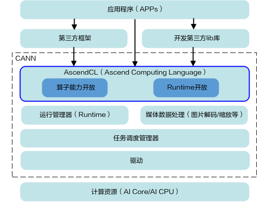
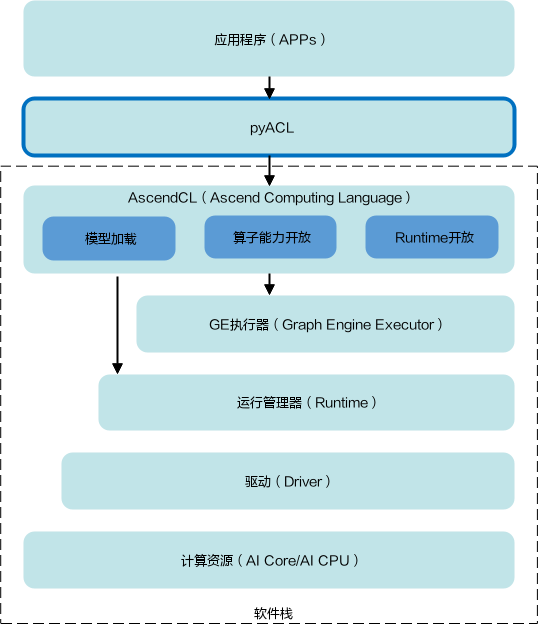

# 基于[AscendCL (python) ](https://www.hiascend.com/document/detail/zh/Atlas200IDKA2DeveloperKit/23.0.RC2/Application%20Development%20Guide/aadgp/aclpythondevg_0000.html)运行模型

AscendCL（Ascend Computing Language）是一套用于在昇腾平台上开发深度神经网络应用的C语言API库，提供运行资源管理、内存管理、模型加载与执行、算子加载与执行、媒体数据处理等API，能够实现利用昇腾硬件计算资源、在昇腾CANN平台上进行深度学习推理计算、图形图像预处理、单算子加速计算等能力。简单来说，就是统一的API框架，实现对所有资源的调用。



pyACL（Python Ascend Computing Language）就是在AscendCL的基础上使用CPython封装得到的Python API库，使用户可以通过Python进行昇腾AI处理器的运行管理、资源管理等。



代码编写模板可以参考[快速入门](https://www.hiascend.com/document/detail/zh/Atlas200IDKA2DeveloperKit/23.0.RC2/Application%20Development%20Guide/aadgp/aclpythondevg_0001.html#ZH-CN_TOPIC_0000001723425033__section430918214352)。

# 基于[MindX SDK](https://www.hiascend.com/document/detail/zh/Atlas200IDKA2DeveloperKit/23.0.RC2/Application%20Development%20Guide/msadg/mxvisionug_0053.html)进行应用开发

MindX SDK 是昇腾 AI 开发体系中的一个相对高层的开发工具套件，它的目标是 **大幅简化昇腾芯片的应用开发和部署过程**，尤其是用于实际场景中的 AI 应用快速落地。

它把原本需要你手动调用 AscendCL 的复杂流程都做了封装，让你可以像写业务逻辑一样来构建 AI 应用，不需要深入底层 AscendCL。

1. 首先进行[初始化](https://www.hiascend.com/document/detail/zh/Atlas200IDKA2DeveloperKit/23.0.RC2/Application%20Development%20Guide/msadg/mxvisionug_0053.html)：

    ```
    from mindx.sdk import base
    base.mx_init()
    # 执行全局初始化后即可正常调用mxVision接口
    ```

2. MindX SDK中封装了一些关于[媒体数据预处理](https://www.hiascend.com/document/detail/zh/Atlas200IDKA2DeveloperKit/23.0.RC2/Application%20Development%20Guide/msadg/mxvisionug_0055.html)的操作，例如图片解码、图片编码、抠图、缩放等等。

3. 进行[模型推理](https://www.hiascend.com/document/detail/zh/Atlas200IDKA2DeveloperKit/23.0.RC2/Application%20Development%20Guide/msadg/mxvisionug_0064.html)：
   
    ```
    import numpy as np
    from mindx.sdk import base 
    from mindx.sdk.base import Tensor, Model
    # 模型推理  
    # 构造输入Tensor（以二进制输入为例）
    # 读取前处理好的numpy array二进制数据   
    input_array = np.load("preprocess_array.npy")  
    # 构造输入Tensor类并转移至device侧  
    input_tensor = Tensor(input_array)  
    input_tensor.to_device(device_id)  
    # 构造输入Tensor列表  
    input_tensors = [input_tensor]  
    # 模型路径  
    model_path = "resnet50_batchsize_1.om"  
    # 初始化Model类  
    model = Model(modelPath=model_path, deviceId=device_id)  
    # 执行推理  
    outputs = model.infer(input_tensors)
    ```